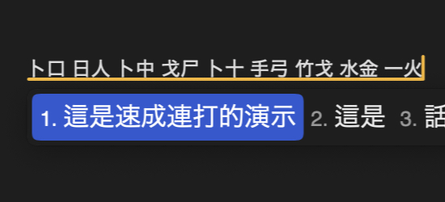
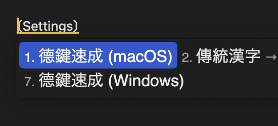
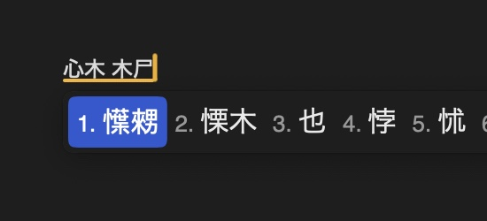
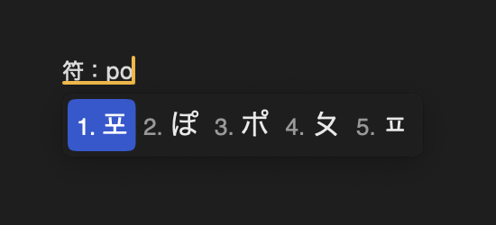

# RIME-Config-Quick5

A RIME configuration for typing Quick5 (速成) efficiently.

## Overview

This configuration enables **continuous Quick5 typing** (“速成連打”), allowing you to type words and phrases fluidly without selecting individual characters after each code. It also supports both **English (US)** and **German (DE)** keyboard layouts and extends Quick5 typing to cover **Japanese Kokuji**, **Korean Gukja**, and **Vietnamese Chữ Nôm** characters.

## Installation

To use this configuration:

1. Install a [RIME](https://github.com/rime) version that fits your operating system.

2. Clone or download this repository.

3. Copy the contents of the [`./config`](config) directory into RIME’s user configuration folder:

    - On macOS: `~/Library/Rime/`
    - On Windows: `C:\Users\<your-username>\AppData\Roaming\Rime`

4. Launch RIME’s settings menu and select “Deploy” to apply the configuration.

## Features

-   **Continuous Typing (“速成連打”)**
    Unlike traditional Quick5 setups where you must confirm each character individually, this configuration supports uninterrupted typing—words and phrases are automatically composed as you type.

	

-   **Multi-Language Keyboard Support**
    Works with both English (US) and German (DE) physical keyboard layouts. See [Keyboard Layout Selection](#keyboard-layout-selection) for details.

	

-   **Extended Character Support**
    Most Chinese characters are supported, as well as many Japanese Kokuji, Korean Gukja, and Vietnamese Chữ Nôm using the Quick5 code.

	

-   **Additional Scripts**
    Japanese Kana, Korean Hangul, Bopomofo, and Greek letters can be typed using the symbol hotkey `符`.

	

## Keyboard Layout Selection

To switch between layouts, press `F4` in RIME. The following input methods are available:

-   `英鍵速成` – for English (US) keyboard
-   `德鍵速成 (macOS)` – for German keyboard on macOS
-   `德鍵速成 (Windows)` – for German keyboard on Windows

### macOS Users

RIME on macOS uses the keyboard layout of your **last selected alphabetical input source**. Ensure it matches your physical keyboard. Then choose the appropriate layout:

-   English keyboard → `英鍵速成`
-   German keyboard → `德鍵速成 (macOS)`

### Windows Users

RIME on Windows always assumes an English keyboard layout. If you use a German physical keyboard, select `德鍵速成 (Windows)` for correct mapping.
