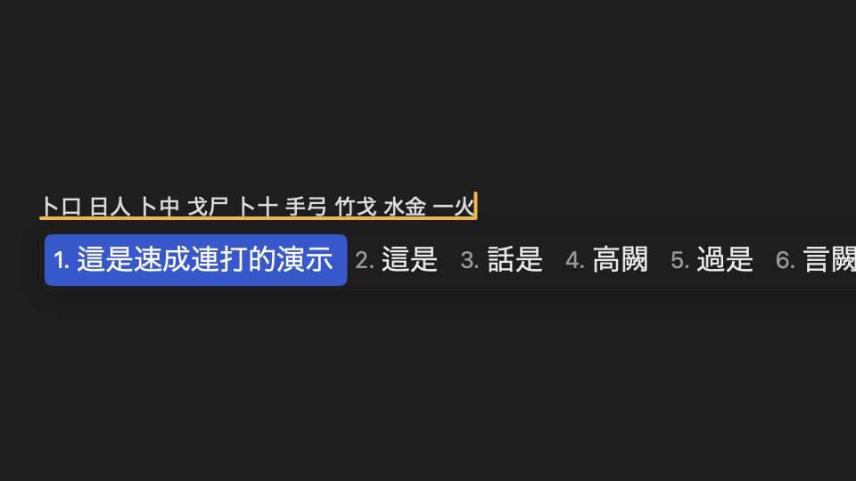
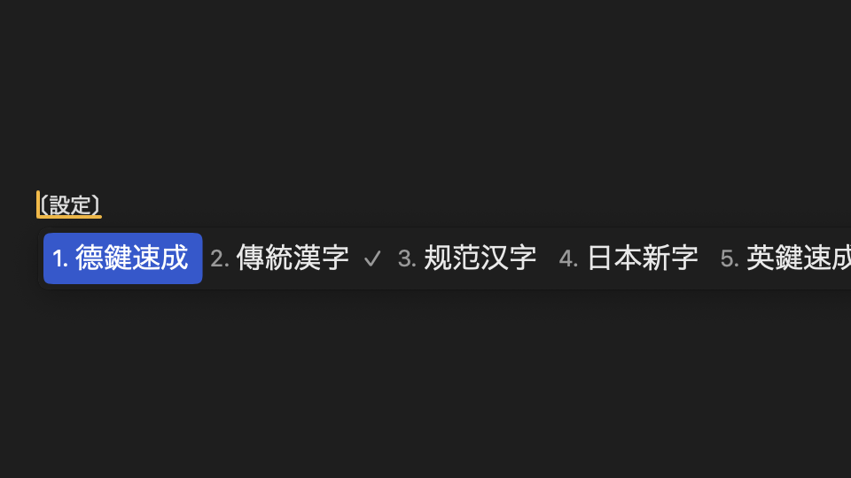
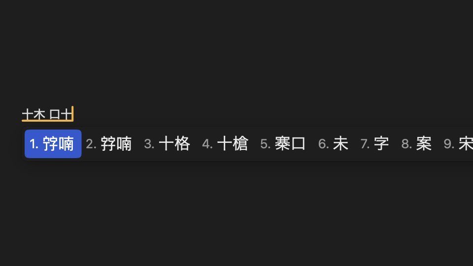
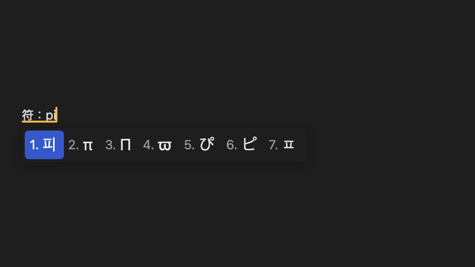
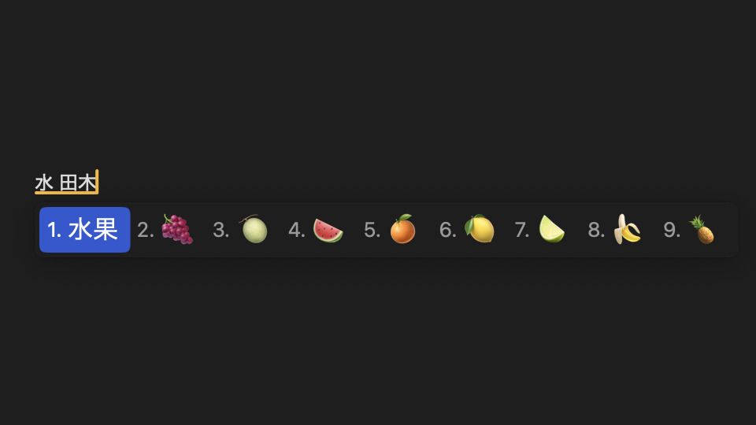
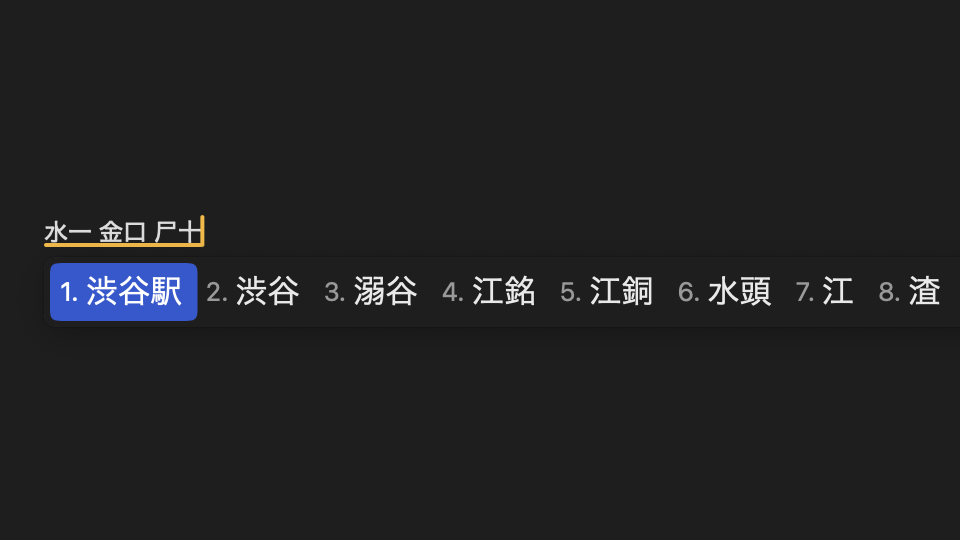

# RIME-Config-Quick5 (℞ quick5-eason)

A RIME plum recipe and configuration for typing Quick5 (速成) efficiently.

## Overview

This configuration enables **continuous Quick5 typing** (“速成連打”), allowing you to type words and phrases fluidly without selecting individual characters after each code. It supports both **English (US)** and **German (DE)** keyboard layouts and extends Quick5 typing to cover **Japanese Kokuji**, **Korean Gukja**, and **Vietnamese Chữ Nôm** characters.

## Installation via Plum

Install this recipe and its dependencies using [plum](https://github.com/rime/plum) (`rime-install`):

```bash
# Option 1: Install full package suite (dependencies + quick5-eason recipe)
bash rime-install easonwong-de/rime-config-quick5/quick5-packages.conf

# Option 2: Install specifying packages explicitly
bash rime-install cangjie quick emoji cantonese Iorest/rime-dict easonwong-de/rime-config-quick5:install
```

This installs all required upstream dependencies alongside this recipe:
- [rime-quick](https://github.com/rime/rime-quick) (base Quick5 dictionary and assets)
- [rime-cangjie](https://github.com/rime/rime-cangjie) (Cangjie 5 dictionary)
- [rime-emoji](https://github.com/rime/rime-emoji) (Emoji OpenCC converter)
- [rime-cantonese](https://github.com/rime/rime-cantonese) (Cantonese vocabulary)
- [rime-dict](https://github.com/Iorest/rime-dict) (Extended community dictionaries via `luna_pinyin.extended`)

After installation, launch RIME’s settings menu (or trigger your frontend's deployment) to apply the configuration.

## Features

- **Continuous Typing (“速成連打”)**
  Unlike traditional Quick5 setups where you must confirm each character individually, this configuration supports uninterrupted typing—words and phrases are automatically composed as you type.



- **Multi-Language Keyboard Support**
  Supports **English (US)** and **German** layouts (affecting punctuation only, not the Quick5 arrangement). Switch via `F4`: select `英鍵速成` for US or `德鍵速成` for German keyboards.



- **Extended Character Support**
  Most Chinese characters are supported, as well as many Japanese Kokuji, Korean Gukja, and Vietnamese Chữ Nôm can be typed out using Quick5.



- **Additional Scripts**
  Japanese Kana, Korean Hangul, Bopomofo, and Greek letters can be typed using the symbol hotkey `符`.



- **Emoji Suggestions**
  Type emojis easily using Chinese keywords and single-letter Cangjie radicals. Powered by [rime-emoji](https://github.com/rime/rime-emoji) and custom radical additions.



- **Character Conversion**
  Easily toggle conversion to Simplified Chinese or Japanese Shinjitai via the `F4` menu.


